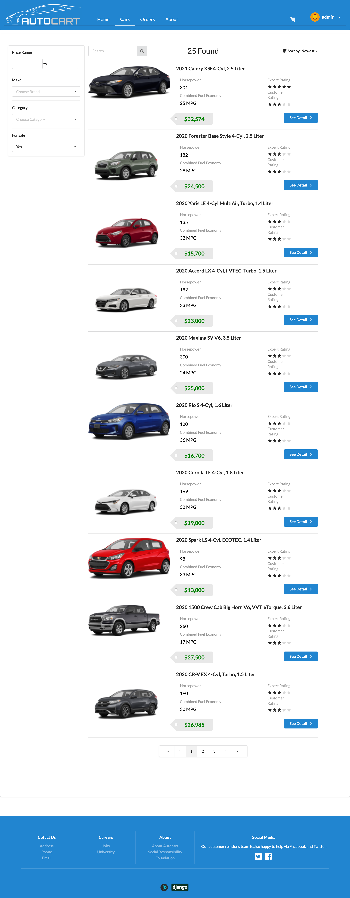
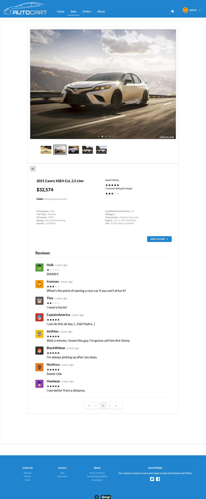

# Autocart


## Description

An ecommerce website with Django and React. 

### Tech Stack

- front-end
	- React
	- Redux
	- Router
	- Axios
	- Semantic Ui	
	- Webpack

- back-end
	- Django
	- REST framework
	- JWT
	
- storage
	- SQLite(master)
	- PostgreSQL(heroku branch)
	- MySQL(gcloud branch)

- deployment
	- Heroku
	- Google Cloud

### Features

- authentication
- product list
- cart
- order history
- rating and comment
- edit mode for administrator 


## Demo

[demo](https://auto-cart.herokuapp.com/) on Heroku

## How to run

```
# create virtual environment
pip3 install pipenv
pipenv --three

# enter virtual environment
pipenv shell

# backend dependencies
pipenv install

# frontend dependencies 
npm install

# loaddata
python manage.py loaddata db.json

# run serve on localhost:8000
python manage.py runserver

# run webpack for dev, 'npm run build' for production
npm run dev
```

## Screenshots




